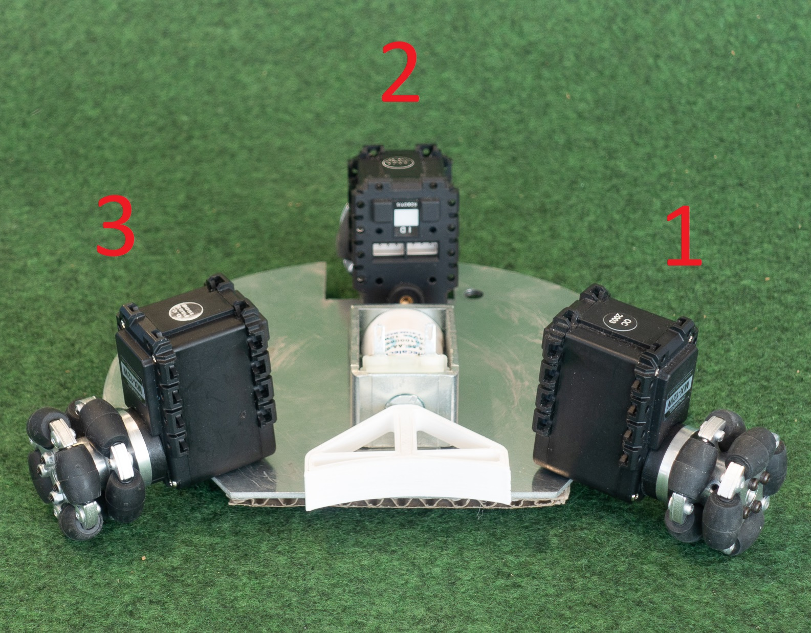
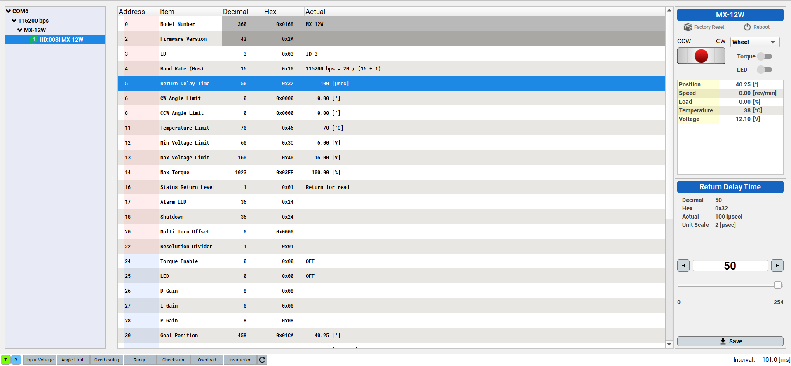
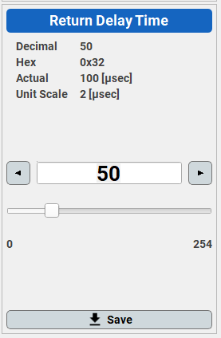

# projet-robocup
Codes permettant de faire fonctionner les robots du projet Saphire Robocup 2022-2023 .

<h1>Configuration d'un robot</h1>
<h2>Configuration des moteurs MX12</h1>
Plusieurs registres sont à modifier sur chaque MX12.
Ces registres peuvent être changés à l'aide du logiciel dynamixel-wizard :
<a href="https://emanual.robotis.com/docs/en/software/dynamixel/dynamixel_wizard2/#software-installation"> https://emanual.robotis.com/docs/en/software/dynamixel/dynamixel_wizard2/#software-installation</a>
 
Il est nécessaire d'avoir un module de communication entre l'ordinateur et les MX12.
<h3>Identifiants de moteurs</h3>
Les identifiants des moteurs doivent être réglés selon l'image suivante : 

<h3>Réglage de return delay time</h3>
Le registre <b>Return Delay Time</b> doit être réglé à <i>100 μs</i>.
Il faut mettre 50 sur l'interface, l'unité étant de <i>2 μs</i>.

<h3>Configuration de l'identifiant du robot et du canal de transmission</h3>
Par défaut l'identifiant du robot est égal à 0 et le canal de transmission à 10.
Il faut les modifier dans le main.

<h1>Structure du projet</h1>
Tous les codes relatifs au robot sont dans le répertoire Robot.
Tous les codes relatifs à l'émetteur sont dans le répertoir PC-Coach. 
<h2>main.py</h2>
Décrit le comportement du robot à l'aide des différents modules.

<h2>menu.py</h2>
Module permettant à l'utilisateur
d'accéder à un menu où il peut modifier
l'identifiant du robot et le canal de transmission.

<h2>refpin.py</h2>
Référence les pins utilisés avec des noms explicites.

<h2>drible.py</h2>
Module pour le contrôle du moteur de drible.

<h2>tircharge.py</h2>
Module où sont définis les fonctions de commande de charge du condensateur
et de commande de tir.

<h2>mx12.py</h2>
Module pour le contrôle des moteurs mx12.

<h2>telecom.py</h2>
Module pour la communication radio avec le coach

<h2>test.py</h2>
Description d'un routine de test permettant de valider le bon fonctionnement du robot
